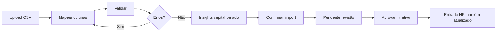

# PRD — Parceiros: Insumos, ERP e MVP 90 dias

> App: `apps/retailer` · Painel `/parceiros/painel` · Insumos ≠ ofertas (`produtos_loja`)

## Visão

Lojistas gerenciam **matéria-prima e estoque interno** (insumos), com entrada contínua via NF e ponte opcional a ERPs (Bling piloto). O valor do produto não é a planilha — é a **análise financeira pós-importação** e o **ciclo NF → estoque atualizado**.

---

## Sprint 1 — Importação controlada (engenharia)

### Objetivos de produto

1. **Ingestão controlada** — CSV/ERP não grava direto como ativo; passa por validação e revisão.
2. **Mapeamento de colunas** — de-para agnóstico (Bling, Tiny, planilha própria).
3. **Valor imediato** — após validação, mostrar % capital em possível baixo giro.
4. **Onboarding** — importação inicial + NF para manter sem esforço.

### Checklist engenharia

- [x] **Módulo de validação de importação**
  - `POST /api/parceiros/painel/insumos/import/validate`
  - Alias PRD: `POST /api/retailer/validate-import`
  - Valida: custo médio, categorias (sugestão de criação), SKU/EAN duplicados (arquivo + loja)
- [x] **UI de associação de colunas**
  - `MerchantInsumoImportFlow` — upload CSV → mapeamento → preview → pendente → aprovar
- [x] **Status pendente de revisão**
  - Colunas: `status_revisao`, `sku`, `categoria`, `import_lote_id`
  - Tabela: `insumos_import_lotes`
- [x] **Confirmação e aprovação**
  - `POST .../import/confirm` — grava `ativo=false`, `status_revisao=pendente`
  - `POST .../import/approve` — ativa lote ou todos pendentes
- [ ] **Sync API ERP (Bling)** — Sprint 2: fetch por URL/token, não só CSV
- [ ] **Painel custo mensal / export CSV** — Sprint 3

### SQL (Supabase)

Executar: `supabase/run-insumos-import-controlado.sql`

### Fluxo do lojista

---

## Sprint 2 — Entrada por NF (entregue)

- OCR foto + QR NFC-e
- APIs: `notas-entrada/process-image`, `fetch-nfce`, `confirm`
- UI: `MerchantNotaEntradaFlow`

---

## Sprint 3 — Analytics e export

- [ ] Dashboard custo mensal por categoria
- [ ] Export CSV insumos (padrão FinMemory)
- [ ] Integração Bling OAuth / polling

---

## Regras de arquitetura

- Scrapers externos → `enqueuePromocoes()` (insumos são fluxo lojista, insert direto em `insumos_loja` permitido)
- Insumos **não** aparecem no mapa consumidor
- Realtime: `insumos_loja`, `notas_entrada_loja`, `produtos_loja`

---

## Arquivos principais

| Área | Path |
|------|------|
| Validação | `apps/retailer/lib/merchant/insumos/validateInsumoImport.js` |
| CSV | `apps/retailer/lib/merchant/insumos/parseCsvText.js` |
| APIs | `pages/api/merchant/insumos/import/*.js` |
| UI | `MerchantInsumoImportFlow.jsx`, `MerchantInsumosSection.jsx` |
| SQL | `supabase/run-insumos-import-controlado.sql` |
