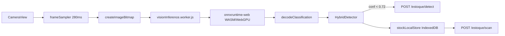

# Scanner de estoque por visão computacional

Arquitetura **híbrida offline-first** com **ONNX Runtime Web** em Web Worker.

## Quick start (exemplo concreto)

```bash
# 1. Dependências + artefatos WASM + modelo demo
npm install -w @finmemory/retailer onnxruntime-web
npm run vision:setup -w @finmemory/retailer

# 2. Subir o retailer
npm run dev:retailer

# 3. Abrir no celular ou desktop (HTTPS em produção)
# /parceiros/painel/estoque/camera → aba "Visão IA"
```

O modelo demo (`public/models/stock-v1/model.onnx`) classifica por **cor dominante**:
| Cor aproximada | Classe demo | EAN demo |
|----------------|-------------|----------|
| Vermelho/marrom | arroz 5kg | 7891234567890 |
| Verde/escuro | feijao preto 1kg | 7891234567891 |
| Amarelo/dourado | oleo soja 900ml | 7891234567892 |

Cadastre insumos com esses EANs no painel para ver o estoque atualizar com borda **verde** (local).

## Fluxo



## Estrutura de pastas

```
apps/retailer/
  lib/vision/
    onnx/
      OnnxWorkerClient.js       # ponte main ↔ worker
      preprocessBitmap.js       # letterbox 320×320 NCHW ImageNet
      decodeClassification.js   # softmax + argmax
    workers/
      visionInference.worker.js # inferência fora da UI thread
    detectors/
      LocalDetector.js          # carrega ONNX via worker
      HybridDetector.js
  public/
    models/stock-v1/
      model.onnx                # gerado por scripts/vision/export-demo-classifier-onnx.py
      labels.json               # classes + EAN + metadados I/O
    ort/                        # WASM copiado por scripts/vision/copy-ort-wasm.mjs
scripts/vision/
  export-demo-classifier-onnx.mjs   # Node (sem Python)
  export-demo-classifier-onnx.py    # alternativa Python
  copy-ort-wasm.mjs
```

## Contrato do modelo (substituir o demo)

| Campo | Valor |
|-------|-------|
| Input | `images` float32 `[1, 3, 320, 320]` NCHW |
| Normalização | ImageNet mean/std (ver `preprocessBitmap.js`) |
| Output | `logits` float32 `[1, N]` |
| labels.json | `classes[].label` alinhado a `insumos_loja.nome`; `ean` opcional |

### Exportar YOLOv8-cls treinado (Ultralytics)

```bash
yolo classify train model=yolov8n-cls.pt data=./dataset epochs=50 imgsz=320
yolo export model=runs/classify/train/weights/best.pt format=onnx imgsz=320 simplify=True
cp runs/classify/train/weights/best.onnx apps/retailer/public/models/stock-v1/model.onnx
```

Atualize `labels.json` com os nomes das pastas do dataset (`dataset/train/arroz_5kg/`, etc.).

### Exportar para Android (TFLite)

```bash
yolo export model=best.pt format=tflite imgsz=320
# assets/stock_detector.tflite + LocalDetector.kt
```

## Performance (implementado)

| Otimização | Detalhe |
|------------|---------|
| Web Worker | Câmera não trava durante inferência |
| WASM SIMD threaded | Headers COOP/COEP só na rota `/estoque/camera` |
| WebGPU → WASM | Fallback automático no worker |
| Letterbox 320px | Alvo &lt;200ms em WASM mobile |
| Warmup | 1ª inferência descartada no `init` |
| Single-flight | `busyRef` descarta frames durante inferência |

Variável opcional: `NEXT_PUBLIC_VISION_MODEL_URL=/models/stock-v1/model.onnx`

## Fallback nuvem

| Variável | Descrição |
|----------|-----------|
| `VISION_INFERENCE_URL` | FastAPI/YOLO servidor — POST `{ image_base64, loja_id }` |
| `VISION_INFERENCE_SECRET` | Bearer opcional |

## UI / feedback

| Estado | Visual |
|--------|--------|
| Detecção local OK | Borda verde — “Local · instantâneo” |
| Fallback nuvem | Borda âmbar — “Nuvem · processando” |
| Modelo ausente | Aviso âmbar com comando `vision:setup` |

## APIs

- `POST /api/parceiros/painel/estoque/detect`
- `POST /api/parceiros/painel/estoque/scan`

## Deploy

Antes do build de produção:

```bash
npm run vision:setup -w @finmemory/retailer
npm run build:retailer
```

Garanta que `public/ort/` e `public/models/stock-v1/model.onnx` entram no artefato standalone.
